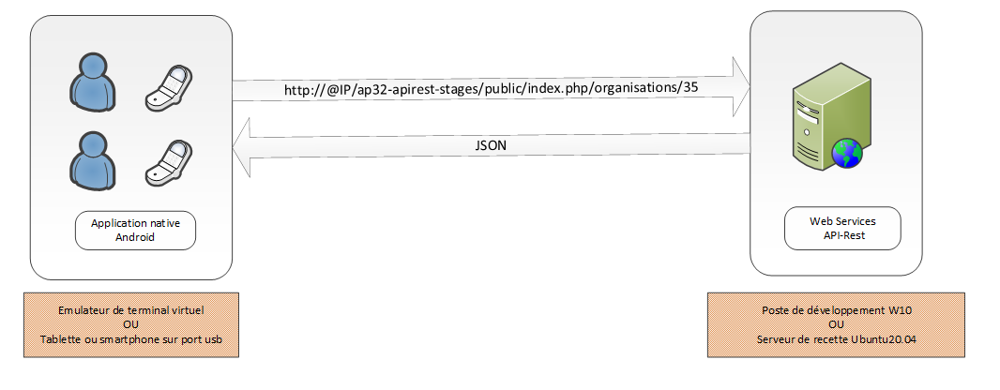
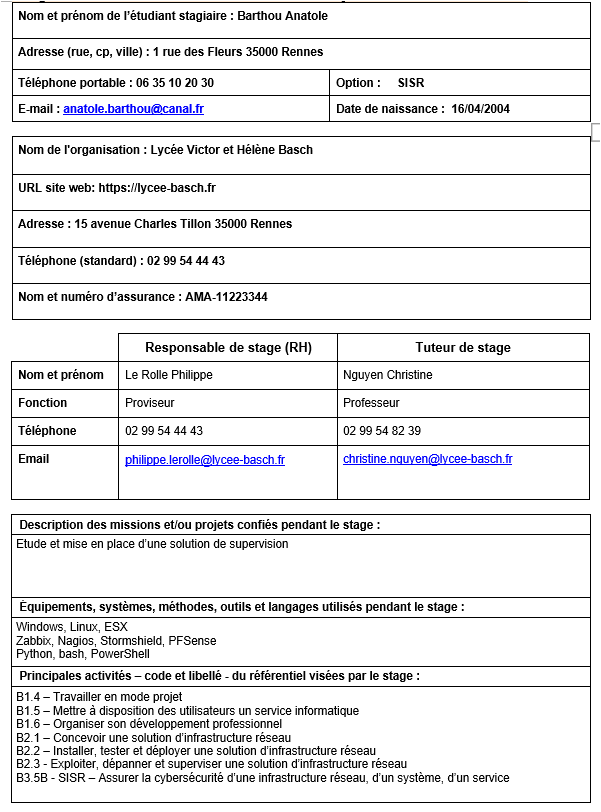

# API-Rest Stages
## Contexte
Le lycée VHB prépare des étudiants au BTS SIO – Services Informatiques aux Organisations. Les deux options du BTS sont : 
- option A - SISR - Solutions d'Infrastructure Systèmes et Réseaux, 
- option B - SLAM - Solutions Logicielles Applications Métiers. 

Afin de valider leur BTS, les étudiants de la section TS SIO effectuent un stage de 5 à 6 semaines par année.
Pour faciliter la mise en contact des étudiants avec des organisations connaissant la formation et ayant déjà eu l'occasion d'accueillir des stagiaires, les données liées aux stages sont conservées avec des mises à jour de l'existence ou non des organisations, et de la présence ou non des contacts dans une organisationn donnée. Elle peut aussi servir à rechercher des professionnels de l'informatique pour participer aux commissions de l'épreuve E4 - Support et mise à disposition des services informatiques.

Actuellement, cette base de données est utilisée par l'application web HistoStages accessible ici. Elle est à destination des étudiants et professeurs de la section, ces derniers étant authentifiés via leur adresse mail sur le domaine lycee-basch.fr.

Suite à des échanges entre professeurs de la section, 2 besoins principaux émergent :

- faire évoluer cette base de données pour que les étudiants puissent eux-mêmes saisir les informations nécessaires à l'élaboration de leur fiche de validation de stage,
- proposer une API-Rest concernant les ressources liées aux stages afin d'élargir les applications clientes potentielles (web, mobile)

Une application cliente mobile sous Android fera l'objet d'un développement dans le cadre du 3ème atelier de professionnalisation.

## Domaine de gestion des stages
La 1ère période de stage est en fin de 1ère année et la 2ème période se situe entre les vacances de décembre et celles de février. 

Il se peut que certains étudiants aient des dates de stages différentes de celles définies par défaut pour la promotion. Les stages de deux étudiants peuvent donc se dérouler à des périodes différentes.  

Les étudiants doivent valider des blocs de compétences qui peuvent être communs ou spécifiques à leur option. 

Le bloc 1 – B1 Support et mise à disposition des services informatiques – est commun aux deux options, SISR et SLAM ; tandis que les compétences des blocs 2 et 3 sont différentes selon l’option. 

Par exemple, la compétence B3.5-A-Assurer la cybersécurité d'une infrastructure réseau est la compétence du bloc 3 – B3 Cybersécurité des services informatiques - de l’option SISR ; celle correspondant à l’option SLAM est B3.5-B-Assurer la cybersécurité d'une solution applicative et de son développement. 

Lors d’un stage effectué dans une organisation, une partie des compétences de chaque bloc sont mobilisées.

Une organisation peut proposer plusieurs stages. Les organisations sont classées selon différentes catégories (Administration, collectivités locales ; Banque, finance, assurance ; Conseil ; Santé...).  

La section sauvegarde aussi les coordonnées des contacts d’une organisation. Un contact peut être tuteur et/ou responsable d’un stage. L'identifiant d’un stage et la connaissance d’un rôle, tuteur ou responsable, permet de connaître le contact.  

Les informations sur l’étudiant, l’organisation, les contacts et le stage sont essentiellement collectées via la fiche de validation de stage. 

## Exemple de fiche de validation de stage
L'exemple fourni ci-après va permettre de faire le point sur les données déjà présentes dans la base existante et les nouvelles données.

## Exigences sur les évolutions de la base de données
Les évolutions de la structure de la base de données doivent permettre d'établir la fiche de validation de stage des étudiants de la section STS-SIO.

Ces évolutions prendront en compte les besoins en sécurité des données :
- intégrité d'entité,
- intégrité de domaine,
- intégrité référentielle
- 
Et les bonnes pratiques de nommage des tables, colonnes et contraintes fournies [./bd_guidelines.md](ici).

On profitera de ces évolutions pour vérifier si la structure existante de la base respecte bien les bonnes pratiques de nommage ainsi que les règles d'intégrité des données.

Ces évolutions doivent être accompagnées d'une mise à jour de la fiche de registre pour le traitement Gestion des stages de la section STS-SIO. Le délégué à la protection des données opérera en effet ces rectifications au cours du mois de janvier.
On doit apporter un soin particulier au recensement exhaustif de toutes les données à caractère personnel, et celles sensibles, ainsi qu'à leur durée de conservation et aux mesures de protection de ces données.
On proposera des solutions sur le devenir de ces données au terme de la durée limite de conservation.

## Exigences sur l'API-Rest
La section souhaite créer des web services de type API-REST permettant la gestion des stages, de la recherche jusqu’à la création de stage. Il sera alors possible de réaliser différents types d'applications, mobile, web, bureau, s'appuyant sur cette API-REST. Cette dernière sera invoquée en premier lieu à partir d’une future application mobile Android. 

Les cas d’utilisation possibles sont : 

Pour les étudiants :
- Lister/ajouter/modifier une organisation 
- Lister/ajouter/modifier un stage 
- Lister/ajouter/modifier un contact d’une organisation 
- Lister les stages proposés par une organisation 
- Rechercher les organisations d’un département ou d’une ville 
- Modifier ses données personnelles 
- Soumettre/Imprimer la fiche de validation de stage 

Pour les professeurs :
- Les mêmes cas des étudiants 
- Lister/ajouter/modifier un ou des étudiants 
- Lister les contacts d’une organisation 
- Lister les fiches de validation soumises à valider 
- Ajouter une période de stage